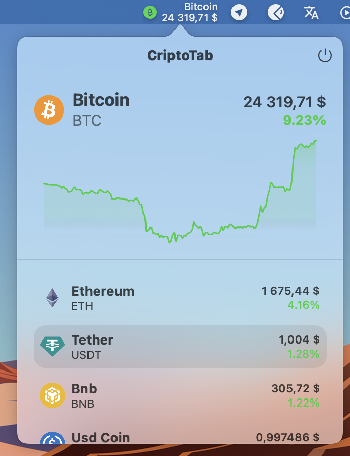

# CriptoTab

### Crypto menu bar for mac OS

An application written in SwiftUI + Combine, MVVM.

## Features:
- Rest API (coingekto.com)
- Updating data via a websocket (coincap.io)
- Autoconnect web-socket
- Saved selected coin
- Menu bar only
- Light and dark mode
- Animations

## Gif 📷

 

 
   

 
 
## Screenshots 📷

 

 
 

   

   

## Author
* [Bogdan Zykov](https://github.com/BogdanZyk)

###

